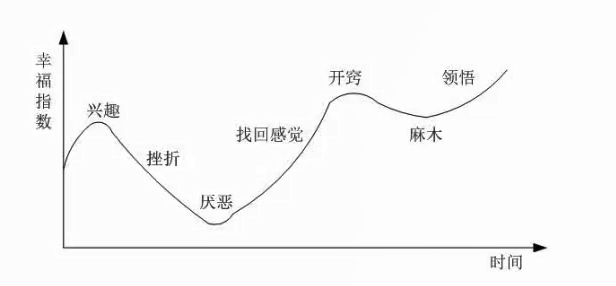
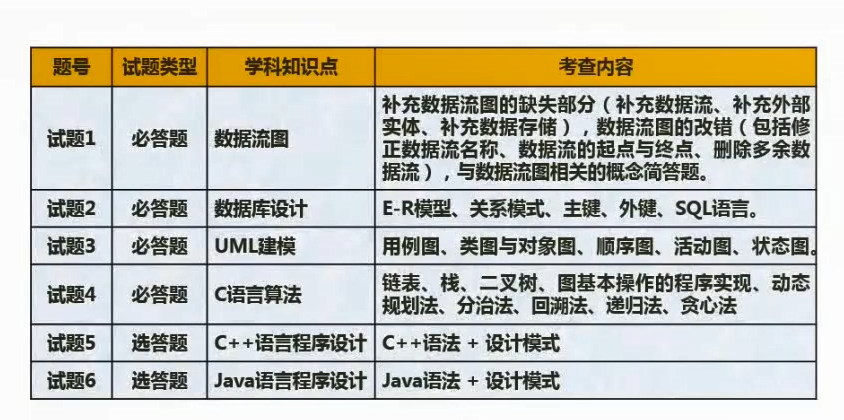
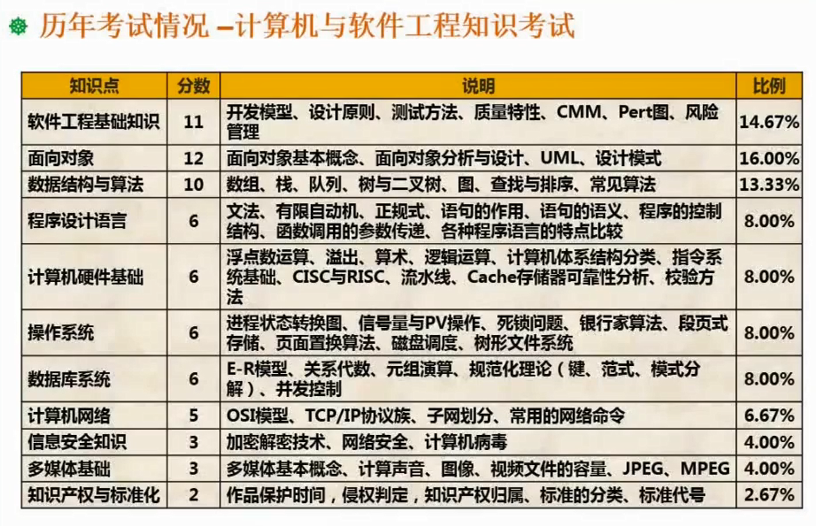

# 1.01  软件设计师考试介绍

我们这个课程探讨的主题是软件设计师考试。在这一个课程当中，我们会讲到软件设计师考试的相关的重点、难点，以及应考的一系列技巧。

软件设计师这个考试引入到中国已经有多年了。最初呢，是从日本引过来的一个考试，就包括软考，整个体系也是这样子。软件设计师考试的前身呢，叫高级程序员考试。在it领域的这一个角色分工一步一步细化的过程中，就变迁到了软件设计师。把这一个考试级别本身的定位定在软件设计这一块。

这个考试难度比较大。整个考试的通过率啊。基本上呢，是维持在10%上下。很多同学参加这个考试，即使已经有多年的工作经验，也做了多年的开发，但发现其实做题不会做。这里面呢，有理论和实践有差距的关系。另外呢，也有一个很重要的因素。**软件设计师的考试考的是广度**。而你平常做项目。无论你做了多少年项目，你不可能把所涉及到的it领域所有知识都囊括进去。你所做的项目仅仅只是it领域知识里面的沧海一粟而已。而且呢，很多时候我们做项目规范程度没有达到书上要求的那么高。所以你会发现我平常不是这么做的。而考试你按你的方式来就不能够得分。

所以说呢，这个有一定实践经验是好的，但是呢，不能够仅凭一些实践经验就能够应对这一个考试，这也是必然的一点。所以呢，在这个里面呢，我们不但是希望在整个课程当中给大家构造起知识数量，还要呢注意一些方法技巧来应对考试。因为他很多地方考察的点非常的固定，然后把这些点给练熟了，相当于你就稳定的把握了一定的分数。然后再来供其他方面扩一扩广度，这个事情呢，就很容易就把它搞定了。

首先呢，讲一讲整个课程的安排会按我们自己的编制的这一个讲义的章节来走。这个章节不一定和官方的教材是一一对应的。因为官方教材很多东西写了他不考，还有很多东西考但是没有写，没有涉及到，所以呢，我们是根据自己的这一个多年的培训的经验总结出来的一套讲义。按这个思路学习下来基本上通过考试是没什么问题的。

整体的这个学习的一个策略是先建立起相应的知识体系。然后再来整知识点。所谓知识体系，就是软件设计师会考哪些科目。先画出来。哪一个科目包含哪几个大的知识，分块画出来。每一个知识分块。常考的点是什么？要把它能够标的出来。这样子就说明你有体系了。

看到一个题，你知道他是在考你哪方面的能力？哎，这个知识体系就基本建成了。建成了有什么好处呢？建成了，你的目标就明确了。你的压力就没那么大了。

很多同学在应对考试的时候方法不得当，花了很长时间看书，这个书都看了两遍。花了几个月时间。但是呢，整体效果不好，原因是什么？原因就是目标不明确，当你盲目看书的时候，能够吸收的东西非常之有限。你觉得看书的时候啥都懂？做题的时候。啥都不懂。

然后呢，做题的时候呢，容易陷入一种误区，我一套题做下来75分的总分。我打了30几分。再看一遍书，再做一套题，结果反而只有20几分。有些人呢，就感到沮丧了，我花了那么多时间，不但没有明显进步，反而退步了。这是怎么回事了？这是因为本身知识广度比较大。然后你是从整体上去看的。你像做题，如果说你不把题分到每一个知识板块，你怎么知道哪一块薄弱需要补，哪一块已经很擅长了，可以不管它了。对不对。

所以说呢，复习的过程中要注意策略。要能够随时的做自查。然后对自己不足的地方，想办法把它补充上来，对自己已经擅长的，那你就稍微做一下题，略过就可以了，把时间集中在短板上面，这样子才有效果。你不要说这一次35分，下一次25分，你要看35分错了哪些题，你懂了哪些问题，25分你又对了哪些，哪些是不该丢分的丢分呢？要去做这种分析，你自己才会有提高。

所以呢，整个课程下来呢，我希望能够建立起大家的知识体系。至于具体哪一个知识点你不懂，这个很好解决，第一，你可以翻教程。第二，你可以百度Google之类的啊，这种方式去搜索引擎去找，这都是能够找到的，甚至于跟别人探讨，

但如果说体系没建立起来，往往给人一种感觉是什么呢？就是你花了很多时间，但是没有取得相应的效果，这是很恐怖的一件事情。依据这条幸福曲线来讲。如果说你付出了很多努力。但收获的都是挫折，你对这个事情慢慢的就会失去信心。你会厌恶他，你会希望把他甩的远远的。以考试为例。这个考试考了通过了对你有好处，你愿意花时间去钻研它，但钻研的过程中不断的碰壁，你可能会想，这一次可能难过了，下一次我们再去考，哎，这样子就心态就不好了。所以希望大家注意一旦出现这种心态，请大家想到我这里讲到的幸福曲线，因为等你厌恶到一定的程度，其实会峰回路转。你会重新找到感觉，然后大跨步往前面走。

考试大纲的要求这里列出来了，我不会一一去讲这个考试大纲的要求了。因为考试大纲要求呢，基本上可以用一句话来概括，就是it领域的东西，你或多或少总要知道一些。各个板块他都会考虑。这就是软考的特点，范围极广。所以大纲并不能够给我们什么指导，所以我们的这一个讲义也是依据历年的考试情况来做的综合分析得出来的结论

考试形式两科都是笔试。上午考这个计算机和软件工程基础知识，150分钟，也就两个半小时。是75个选择题，每空一分，所以总分是75分，合格了是45分。哎，为什么这么奇怪呢？就是因为他是从国外引过来的啊。没有改变他的一些传统。第二科就是下午考的这个软件设计，也是两个半小时。也仍然是笔试。下午的这个就是属于问答类型的，其实讲问答类型的不是很准确，因为它里面包括了问答性质的，填空性质的，还有填程序性质的。

下午考软件设计，基本上定型了。第一道数据流图的。第二道这个数据库的。第三道UML的。然后第四道是算法这一块的。用一般用C语言描述算法。数据结构这一块的。最后五六题二选一（C++和Java二选一）面向对象编程，基本上呢是以设计模式为背景来考程序设计这一块。这些题如果说给很有开发经验的人来做，如果说没有详细的准备，它也不能够把它完成了。为什么？因为我们开发过程中呢，很多时候不会去做的那么细致。考试的时候扣的细节。而真正做项目的时候呢？没有去把它做得这么严谨啊，尤其是中国国内的这个环境。

还有一部分同学呢，是压根没有项目经验的，拿着这种题更加头痛了，说我又没有用过数据流图做分析，我又没有用过UML，我连ER图也就是在大学课程里面学数据库的时候了解过一点而已。那又怎么办呢？其实，大可不必担心。虽然很多人是下午这一关没过，但实际上呢，下午题非常有规律，我到时候会给大家一个一个题的剖析。剖析下来之后，你会发现每一次考试，只要你按我的思路去训练，至少有45分左右的题。你可以非常稳定的去把握其他方向的，再随便拿点分这个及格就OK了。因为他考的很稳定。即使有些地方有些题非常难，但是某些部分也能够用规律推导出来。所以方法技巧会比呢你实际的经验更加重要一些，所以需要跟着我的思路去走。

这里呢，是一个历年考试情况的一个分值分布表。表里面呢，有平均分数和比例。以及常见的考点知识点。大家看到这个表可以了解到整个的知识分块，哪些分块考的分值比较高，哪些分块考的分值比较低。这是一个。

第二个，当你做完一套题的时候。你要有意识的去分析自己，这道题没有及格。败笔在哪里？哪一块丢分最多？你比如说面向对象的知识这一套题里面考了13分，因为我这讲的12分，这个屏幕上显示的12分是平均嘛，有的时候13分，14分，有些十分九分。好，假设这一次考了13分，这套题里面。那你只做对了三个。你是不是就应该加强面向对象这一块知识的学习啊？对不对。这个时候呢，你就可以把书翻出来，有针对性的看看你错的题具体是面向对象里面哪一个小的分块，是设计模式的，还是URL基本概念的。好，把这一块加强之后，你下一次练下一套题的时候，这个里面有14分的面向对象的分数，你看看你能够把握几分。哎，一定要通过这种方式细化下来。然后呢，结合自己的学习方案做调整。

有些同学容易犯的一个误区是什么呢？一提到成绩，他就是讲我这套题打了45分，还是打了48分，这个其实我不关心，我关心的是你每个分块情况如何。对于有明显缺漏的部分，你是不是真的花了时间去把它补上来。这才重要。就好比我们软件做测试。测试的目标不是得到一个评价，说这个软件的品质好还是不好。而是找出bug并且修正bug，以提高软件的品质。咱们的测试也是应该抱着同样的目的进行。换句话来讲，你在练习的时候老是打23分，30分，但你每一次把练习错的部分全部搞懂了。那你上考场可能能够打40分，五四十分，50分，60分都有可能。

但如果说你每一次。做的时候就以一种这种不太端正的态度，有些题就是蒙，有些题呢就乱填，好侥幸打了个48分，那你考试的时候很有可能犯同样的错误，然后呢。反而不及格。这是这样的一个基本的情况啊，所以请大家一定要注意这一点。

软件设计部分呢，几个基本的题型呢，这里列出来了。至于具体的一些技巧方法，我们在讲软件设计部分的这几个章节的时候，会结合例题来给大家一一做分析剖析。这就是在整个课程之前，我想跟大家先交流的一个观点。