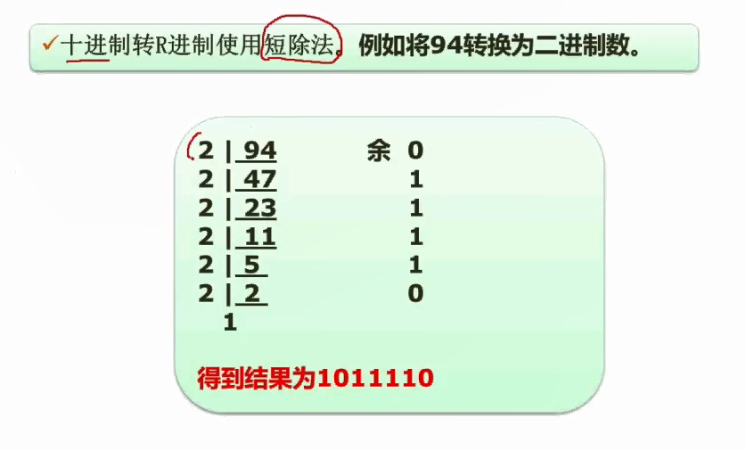

# 2.02  数据的表示(进制的转换)

### R进制->十进制

任何进制转十进制的时候采用的方法都是**按权展开法**。

首先看到的是二进制，只有零和一两种数字。你像我们要把10100.01这样的一个二进制，把它转成十进制，怎么转呢？可以按权展开，所谓按权展开就是拆分每一个位置上的数，把每个位置上的数跟他自己的权相乘。具体一点来讲。这一个零所对应的是二的零次方位置。它相邻的这个是二的一次方位置。这个位置是二的平方位置。二的三次方。二的四次方。这就是每个位置它的权值。这种权值代表什么含义呢？如果说这个位置上出现一个一。比如说二的四次方位置出现一个一。那么它所代表的二进制的十进制的值代表的是多少呢？就是一乘以二的四次方。如果说是二的零次方位置出现一个一呢。他的权值是二的零次方，再去乘以一个一，这就转成了十进制。那么小数点左边的是01234这样子依次上去。就是这个指数是从0123依次下去。完了之后，小数点右边的分别就是二的负一次方。负二次方。以此类推。我们要把这一个数，把它转成十进制，你就按权展开，把每一个位置上的值乘以它的权重就OK了。在这个题里面。对于零的位置啊，它是不用去乘权重的，因为零乘任何数结果都是零，所以不用算，只算一的位置就可以了。第一个一是二的四次方。所以对应了一乘以二的四次方。第二个一它所对应的是二的平方位置，所以一乘二的平方，第三个一是负二次方，所以一乘以二的负二次方。这样就能够把二进制转成十进制。

同样的道理，如果说是七进制。这个不常见的一个进制。很简单，我们只要把二进制当中的二这个底值，把它改成七就行了。因为这个底数就是代表是多少进制，你要转成十进制。是16进制转十进制，那这个底数就变成16了。所以按这种方式是很容易求解的。任何进制都可以很容易的转成十进制

### 十进制->R进制

要从十进制转任意进制，也有统一的方法，称为短除法。

比方说，我们要把十进制转成二进制。那就在短除法里面把二进制作为除数，这个二作为除数。

要把94转成二进制，那我就把94除二。商是多少呢？47。余数为多少？零

因为上47的时候正好除尽是没有余数的，所以为零，所以这个位置记录零，注意余数的记录是至关重要的啊，必须要记余数。

接下来下一步呢，就把47继续除二。除二了上的商是23。余数了为一，所以记在这个位置，余数为一。

23再除二，余数为一，上的商是11。好，继续除，一步一步除到这个位置。

除到这个位置了，其实还可以除。除二。商0。余数为一。

好，这样子呢，就除完了，除完之后二进制就出来了。逆序排上去，把这个余数拼接起来。就是94所对应的二进制数。所以94对应的二进制数就是1011110。就是对应的底下这个数据。

如果说我们要把十进制转16进制，那你就除16。转八进制就除八。方法完全一样。

### 实用技巧

下面呢，再介绍几个很有实用价值。就是二进制、八进制、16进制，它们几种进制之间的一个互相转换的问题。

因为我们在计算机当中要用到的都是二进制，而如果说我们求解的时候都用二进制做运算，那这个计算会非常的繁杂，二进制的数会很长，比如十进制可能只有四五个位的数据，在二进制当中就会有很多位了。二进制和八进制以及16进制有非常严整的对应关系。

每三个二进制位可以对应一个八进制位。假设我们要把这样一个二进制数转成八进制，从右到左分段，每三个一段。最高位的这几个，他不足三个没有关系，你补零就OK了。比如说这里总共只有八个位，从右边开始三位，三位，左边只有两位了，那你高位了，相当于补零就可以了。然后呢，就把每个位转成八进制就可以了。

110转成八进制。110当中的零不用管它，这个一对应的是二的一次方，也就等于二。这个位置的一真实的值是二的平方，也就等于了四。二加四加起来就是六。

第二个位是一，很容易

第三个是二，所以转成八进制就是216。

转成16进制了，就是一对四的关系，一个16进制对四个二进制。

16进制当中，除了我们所用到的10123456789以外呢，还会用到一些字母，为什么用到字母呢？因为到十的话。它就会有两个数字位，你用它来表示一个位就会产生问题，所以十就开始用字母代表。十是a。依次下来，11就是B。12就是C。E对应的是15。

那我要把16进制转二进制，就一位这四位来，我要把16进制转八进制，可以通过二进制，先把了16进制。按每个位对应四个二进制位转成二进制，再拆分成三个一段转成八进制，这就是可以的。像这种方式的话，就让我们在计算一些存储方面的问题的时候简化问题了，我们可以先用16进制计算，然后在适当的时候再转成二进制来做一些相关的一些计算就可以了
