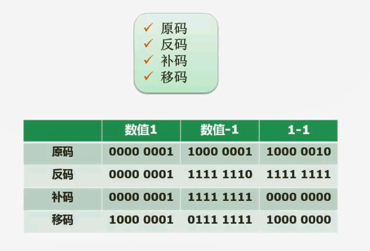
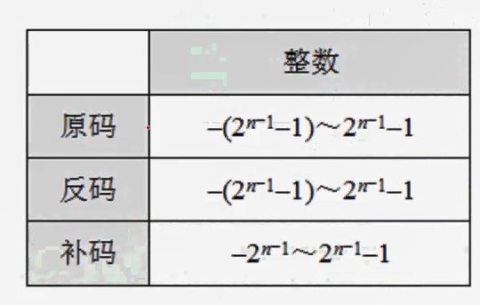

# 2.03  数据的表示(原码反码补码移码)

### 原码

原码就是我们把一个数转成二进制的表达形式。这是第一步。

第二步就是确定这个二进制的最高位（0是正数，1是负数）

一般我们是确定了用多少个字节来存这个数据，如果说是一个字节，也就是八个bit。八个bit它的最高位就是最左边这一位。如果说转成的二进制不足八位，你就往高位补零就可以了。

十进制数`1`转成二进制仍然是`1`。如果说是用一个字节来存储它，那我们就会在左边给它补上七个零。最高位的是符号位。对于正数而言，符号位为`0`。对于负数而言，符号位为`1`。所以如果说是`+1`，它的原码就是`00000001`。如果说它是`-1`，它就是`10000001`。

#### 原码不能用来运算

我们知道如果说我们把一个`+1`加上一个`-1`。就应该等于`0`的，但是用原码进行这样的操作往往行不通，为什么行不通呢？

我们把两个源码直接相加，因为`1 + -1`就应该等于`0`嘛，结果它等于的值是多少呢？是`00000001+10000001=10000010`。就变成了`-2`的原码。所以像原码的这种操纵方式是不能够用来直接在机器里面做相关的运算的。所以呢，提出了一些其他的编码方式，比如说反码。

### 反码

注意一点，反码也是区分正负的。如果说是正数。反码它是和原码完全一样的，相等的。

包括我们后面要讲到的补码。正数的补码和原码也是完全相等的。

负数就有差别，比如说`-1`，先不动它符号位，然后把后面的所有位置`0000001`按位取反

什么叫按位取反？就原来是`0`取反之后就变成`1`。`1`的位置反过来变`0`

那么 `0000001`按位取反就是`1111110`，然后补上符号位得出`11111110`

#### 反码用来运算会怎样

我们知道`+1`的反码是`00000001`

`-1`的反码是`11111110`

那么他们相加就等于`11111111`，根据首位是`1`，判断出这是个负数。然后将剩余的`1111111`按位取反,得出`0000000`，也就是`0`的原码。但是还是有点奇怪，因为这代表了`-0`

### 补码

正数补码和原码反码是一样的

负数补码是在反码的基础之上`+1`

比如`-1`的反码是`11111110`，那么`-1`的补码就是`11111111`。

#### 补码用来运算

我们知道`+1`的补码是`00000001`

`-1`的补码是`11111111`

那么他们相加就等于`00000000`，也就是`+0`

### 移码

移码是在一个特定场合用到的。它用来做浮点运算当中的解码

移码是在补码的基础之上，把首位取反。

为什么要这么做了？因为在补码当中，由于最高符号位，负数符号位是`1`，正数符号位是`0`，这其实在数轴上面表示就有点混乱，颠倒了思想观念。

如果说反过来，我们会发现在数轴上面表现起来就非常漂亮了。就是正数会比负数要大一些，原来补码体现不出这一点

所以用移码进行相关操作也能够得到正确的值，并且看起来还是合理

### 表示范围

比如`n=8`

原码代表范围是 `-(2^7-1) ~ (2^7)-1` 也就是 `-127~127`

**怎么来的呢？**

最大值`01111111`，转10进制就是`127`

最小值`11111111`，转10进制就是`-127`

反码代表范围是 `-(2^7-1) ~ (2^7)-1` 也就是 `-127~127`

**怎么来的呢？**

最大值`01111111`，转10进制就是`127`

最小值`10000000`，`0000000`按位取反得出`1111111`，转10进制就是`-127`

补码代表范围是 `-2^7 ~ (2^7)-1` 也就是 `-128~127`

**怎么来的呢？**

最大值`01111111`，转10进制就是`127`

最小值`10000000`，首先要`10000000` `-1`,得出`01111111`，然后按位取反得出`10000000`，转10进制就是`128`，带上负号则是`-128`

