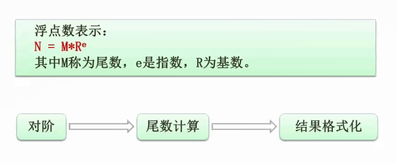
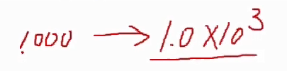
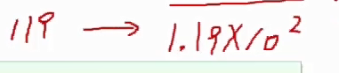
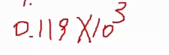

# 2.04  数据的表示(浮点数运算)

### 浮点数

浮点数是指的是科学计算法表示数的方式。

比方说1000。用科学计数法可以计数为`1.0x10^3`

再比方说119。用科学计数法可以计数为`1.19x10^2`

#### 浮点数相加

上面2个数如果要相加，首先需要对阶，一般呢是**从低的往高的对**。

先将`1.19x10^2`对阶为`0.119x10^3`

然后尾数相加，`1.0` + `0.119` `=1.119`，结果也就是`1.119X10^3`

最后格式化这个数，由于`1.119 > 1 并且 1.119 < 10`，所以保持不变。如果反之，还需要挪一下阶码。

就比如 `1.119X10^2 + 9X10^2`，结果是 `10.119X10^2`，就需要格式化为`1.0119X10^3`