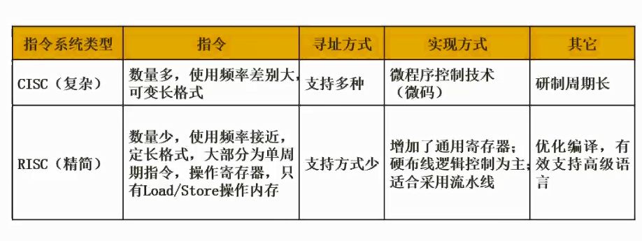

# 2.07  CISC和RISC

### CISC

**Complex Instruction Set Computer，复杂指令系统计算机**

#### 应用

高性能计算，图像处理，多媒体应用，科学计算等

#### 特点

1. 指令集复杂：CISC指令集包含了大量的指令，可以执行复杂的操作，如浮点运算、字符串处理等，这些指令可以在一条指令中完成，因此可以提高程序的执行效率。
2. 指令格式不规则：CISC指令的格式不固定，长度不一，有些指令需要多个时钟周期才能执行完毕。
3. 面向内存：CISC指令集是面向内存的，指令中包含了对内存的直接操作，这使得CISC处理器可以直接访问内存中的数据，而不需要通过寄存器。
4. 硬件复杂：CISC处理器的硬件非常复杂，需要大量的电路来支持各种指令的执行。

### RISC

**Reduced Instruction Set Computer，精简指令集计算器**

#### 应用

智能手机，平板电脑和其他便携式设备

#### 特点

1. **指令集精简**：RISC处理器的指令集非常精简，每条指令的执行时间都非常短，这使得RISC处理器的指令集非常容易实现。
2. **硬件结构简单**：RISC处理器的硬件结构非常简单，因为每条指令都非常简单，所以处理器的控制逻辑也非常简单。
3. **采用流水线技术**：RISC处理器采用了流水线技术，这意味着处理器可以同时执行多条指令，从而提高了处理器的执行效率。
4. **寄存器使用频繁**：RISC处理器的指令集中使用寄存器的频率非常高，这意味着处理器可以更快地访问数据，从而提高了处理器的执行效率。
5. **延迟槽技术**：RISC处理器采用了延迟槽技术，这意味着处理器可以在执行完一条指令之前预取下一条指令，从而提高了处理器的执行效率。