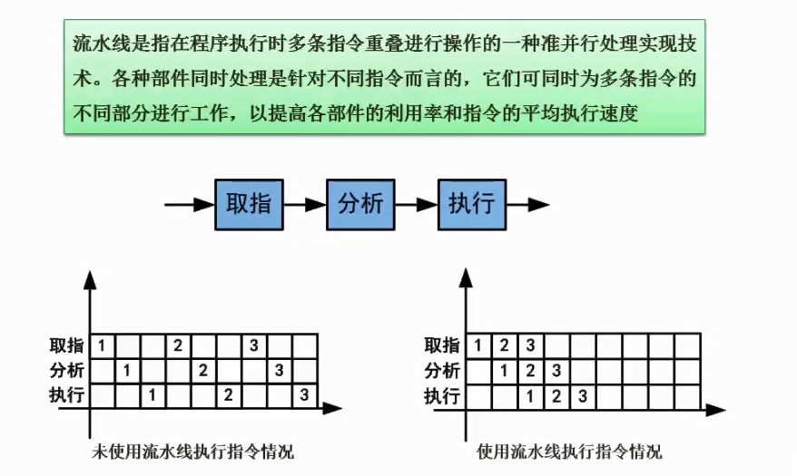

# 2.08  流水线的基本概念

#### 坐标系说明

1. 纵坐标是多条指令
2. 横坐标是单元时间
3. 数字代表一组指令
4. 下面我们都假设**取指，分析，指令**耗时都是n

#### 未使用流水线的特点（左图）

1. 完成一组指令，花费了3n时间。完成三组指令，花费了9n时间。
2. 可以看到在开始【1-指令】的时候，【2-取指】完全在等待。
3. 空格都是空闲状态，代表纵坐标这个指令在这时候没活干

#### 使用流水线的特点（右图）

1. 完成三组指令，只花费了5n时间。
2. 在开始【1-指令】的时候，【2-取指】同步在进行。
3. 效率很高