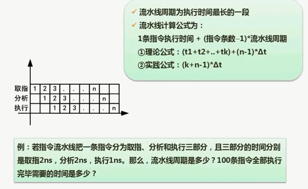

# 2.09  流水线周期及流水线执行时间计算

### 考点

1. 计算流水线执行时长时间
2. 计算流水线周期是多少

### 流水线周期

指令执行最耗时的时间。

- 取指2ns
- 分析2ns
- 执行1ns

那么执行周期就是2ns。

### 执行时间计算

1. 计算这种题需要画坐标系
2. 可以看出规律 
   1. A部分就是完整一个指令时间。2+2+1=7
   2. B部分就是 （n-1）*执行周期
   3. 比如这道题就是：`（2+2+1）+（100-1）*2=203ns`
3. 有时候答案没有203，也可能是这种粗略算法：`（3+100-1）*2=204ns`