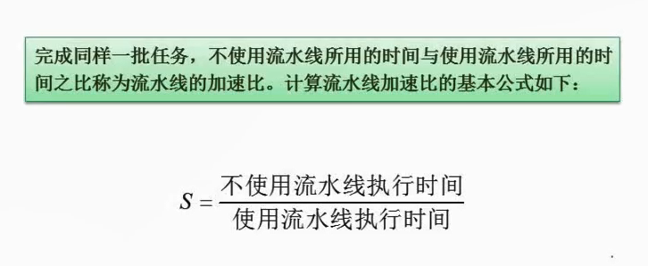
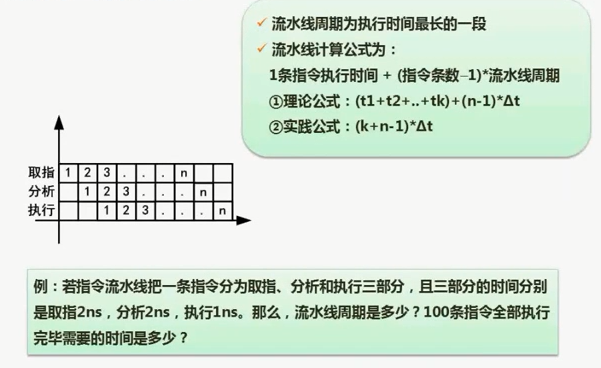
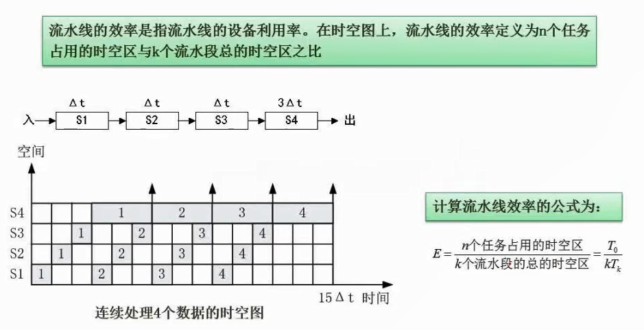

# 2.11  流水线加速比计算

继续这个例子。

不使用流水线耗时：(2+2+1)*100=500ns

使用流水线耗时：203ns

加速比：500/203=2.46

可以看到，即使用了流水线。如果某个环节特别耗时，比如S4，耗费了3倍的时间。

空白区域仍然很多，也就是效率还是很低。

**效率的含义就是阴影位置占比大小。**

灰色格子：（3+3）*4=24

白色格子：15*4=60

效率为：24/60=0.4

