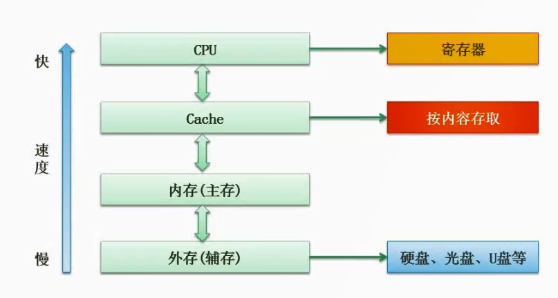

# 2.12  计算机层次化存储结构

1. 寄存器：位于CPU内部，是最快的存储器，用于存储CPU正在执行的指令和数据。
2. 高速缓存：位于CPU和主存之间，是速度比主存快但容量较小的存储器，用于存储频繁访问的数据和指令。
3. 主存：也称为内存，是计算机中容量最大的存储器，用于存储操作系统、应用程序和数据等信息。
4. 辅助存储器：包括硬盘、光盘、U盘等，容量比主存大但速度较慢，用于长期存储数据和程序。