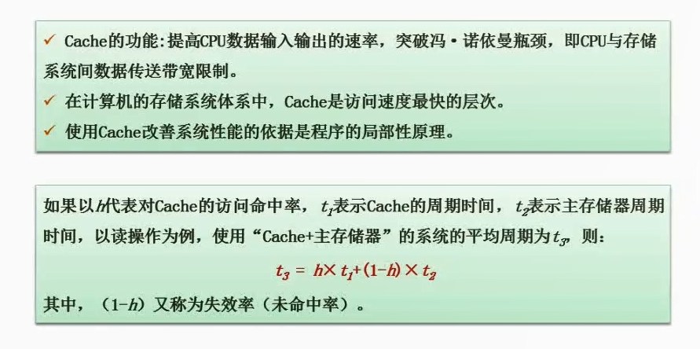

# 2.13  Cache的基本概念

上述公式，代入以下值

1. h代表对cache的访问命中率，假设95%
2. t1代表cache的周期时间，大致是1ns
3. t2代表主存储器的周期时间，大致是1ms
4. 那么在不用cache，仅仅用主存，速度则为1ms，也就是1000ns。
5. 用了cache之后，周期则为`（0.95*1+0.05*1000）=50.95ns`，提升速度`1000/50.95`约等于20倍

