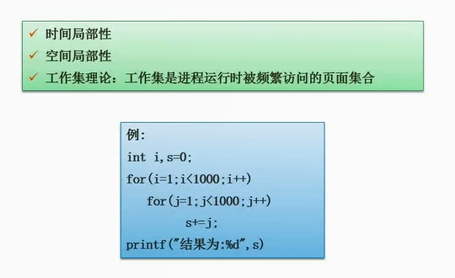

# 2.14  时间局部性与空间局部性

#### 时间局部性

是指程序在执行过程中，对某些数据的访问往往集中在某个时间段内，并且这个时间段很短。这意味着在这个时间段内，这些数据很可能被多次访问，因此将这些数据缓存在高速缓存中可以大大提高程序的性能。

#### 空间局部性

指的是在计算机程序中，访问内存的模式倾向于访问靠近之前访问过的内存地址的数据。这意味着如果程序访问了内存中的某个位置，那么它很有可能会接下来访问相邻位置的内存，而不是距离很远的内存位置。