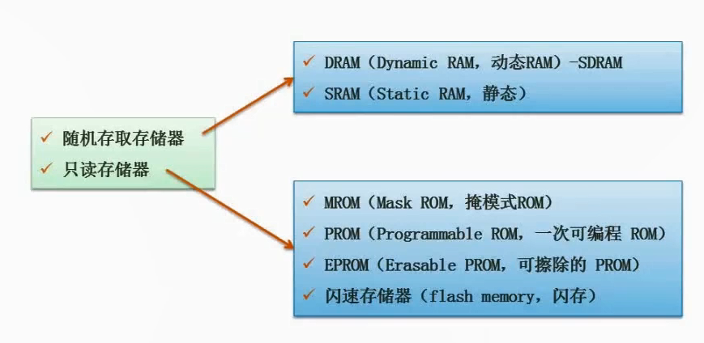
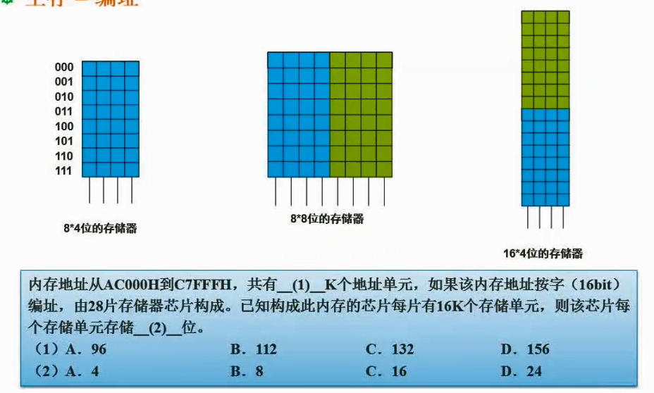

# 2.15  随机存储器与只读存储器

### 随机存取存储器

**Random Access Memory，RAM**

1. 当计算机关闭或断电时，存储在其中的数据就会丢失
2. 可以读取和写入数据
3. 通常用于存储操作系统、应用程序和其他正在运行的程序所需的数据

### 只读存储器

**Read-Only Memory，ROM**

1. 在制造过程中被写入，通常无法被修改或删除
2. 通常用于存储计算机的启动程序和其他重要的系统数据

### 内存其他形式考题

#### （1）计算流程

1. 用`C7FFFH`减去`AC000H`怎么计算呢，一般先把`C7FFF`+1，得出`C8000`。
2. 然后`C8000 - AC000`，`8-C`不够减，借一位，此处是16进制，一位是16。
3. C是十进制的12，`8+16-12=12`也就是C
4. 然后`B-A=1`
5. 得出`1C000H`，转换成二进制也就是 `0001 0110 0000 0000 0000` 
6. 由于我们要除以1024，也就是二进制的`10 0000 0000`
7. 那么两者相除，就是把后面10个0去除，得出`0001 0110 00 `整理一下得出`0101 1000 `，再转换成二进制等于`64+32+16=112`

#### （2）计算流程

1. 题目说内存由28片存储器芯片组成，每片存储16k
2. 由上面那个空得知内存共有112k个地址单元，并且内存地址按16bit编址
3. 那么设每个存储单元存储x位，`28*16*x=112*16`,求出`x=4`

