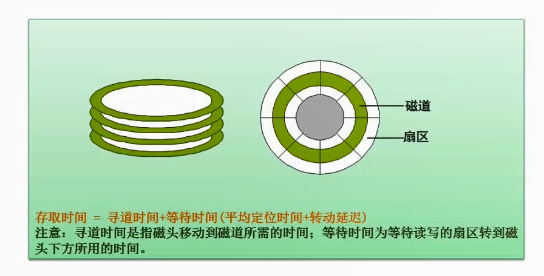
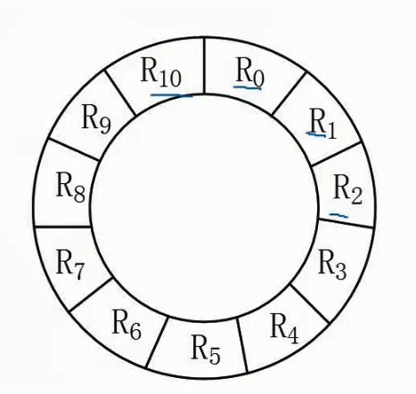
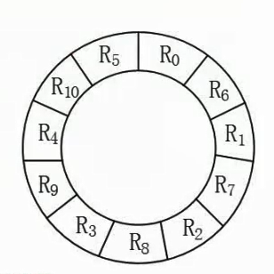

# 2.16  磁盘工作原理

#### 磁道

磁盘上的数据被存储在一个或多个盘片上，每个盘片由许多同心圆构成，这些同心圆被称为“磁道”。

#### 寻道

当计算机需要读取磁盘上的数据时，它必须先找到存储该数据的磁道，这个过程就叫做“寻道”。

#### 寻道时间

寻道时间取决于磁头移动到正确磁道所需的时间。

取决于磁头的移动速度和距离，一个硬盘的平均寻道时间为8毫秒。

#### 磁盘旋转等待时间

是指磁盘旋转到需要读取或写入的数据所在位置所需的时间。

取决于磁盘的旋转速度，一个7200 RPM的硬盘，其磁盘旋转等待时间为4.17毫秒。

#### 题意分析

1. 物理块也就是图1的扇区。可以用上图的圆环来理解11个扇区（R0到R10）。
2. 旋转周期为33毫秒，转一圈一共11个记录，那么每读取一个记录消耗3毫秒。
3. 单缓冲区的意思是读取和处理是同步进行的，比如R0读出来了，他需要处理完了，才能读R1。

#### 计算处理11个记录的最长时间

1. 最长时间就是按顺序R0到R11依次排列。
2. 因为每个记录处理时间为3ms，所以第一个3ms会把R0的信息读出来，此时磁头来到了R1处。但是由于单缓冲区的原因，这时候不能读取R1的内容，需要消耗3ms来处理R0的内容。等待R0内容处理完，此时磁头就来到了R2处。
3. 当前需要读取R1的数据，但是磁头已经到了R2。磁头就需要继续转动，转到R1的位置，需要经过`（11-1）*3=30ms`
4. 然后重复2操作，等R1处理完，磁头来到了R3，那么磁头又需要转30ms去到R2起始处
5. 依次类推，R0-R9都是这样的规律，他们都消耗了`3（读取时间）+3（处理时间）+30（磁头转动时间到下一个位置起始处）=36ms`，也就是消耗了`10*36=360ms`
6. 那么此时磁头已经来到了R10起始处，最后一处记录不需要再转动磁头，因此只有`3（读取时间）+3（处理时间）=6ms`
7. 那么最长时间就等于`360+6=366ms`

#### 计算处理11个记录的最短时间

**由上面计算最长时间可以看出，时间是浪费在每次都需要转圈到下一个记录起始处。那么最短时间则是不消耗这部分时间**

那么扇区分布就应该如下图

1. 因为每个记录处理时间为3ms，所以第一个3ms会把R0的信息读出来，并且经过3ms的处理时间后，磁头刚好就到达R1的起始处。R0的消耗时间则为`3（读取时间）+3（处理时间）=6ms`
2. 依次类推，R0-R10都很完美的一处理完就能到达下一个记录的起始处。
3. 那么消耗时间为`6*11=66ms`

