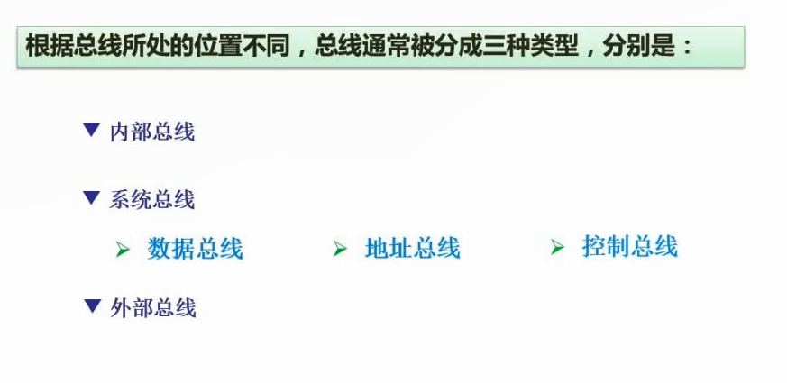

# 2.17  计算机总线

**一般谈到总线都是指系统总线**

#### 数据总线

**双向传输，它的宽度决定了CPU和其他器件之间每次传输的数据量。**

- 数据传输：数据总线可以将数据从一个硬件设备传输到另一个硬件设备，如从内存到CPU，或者从输入设备到内存。
- 控制信号传输：除了数据传输，数据总线还可以传输控制信号，用于控制硬件设备的操作。
- 地址传输：数据总线可以传输地址信息，使得硬件设备可以访问内存中的特定位置。

#### 地址总线

**单向传输，它的宽度决定了CPU可以寻址的内存空间大小。**例如，一个16位的地址总线可以寻址最多64KB(2^16B)的内存空间，而一个32位的地址总线可以寻址最多4GB(2^32B)的内存空间

* 传输CPU发出的内存地址信号，通过地址总线，CPU可以访问内存中的不同位置，从而实现数据的读取和写入。

#### 控制总线

**双向传输，它的信号可以控制CPU和其他器件之间的数据传输和操作。**

- 传输控制信息：控制总线可以传输各种控制信息，例如CPU发出的读写控制信号、中断请求信号等。
- 控制各部件的工作状态：控制总线可以控制各个部件的工作状态，例如内存、硬盘、显卡等。
- 控制各部件的操作：控制总线可以控制各个部件的操作，例如CPU向内存发出的读写操作等。
