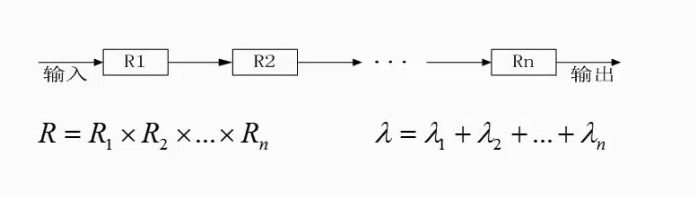

# 2.18  串联系统与并联系统可靠度计算

### 串联系统可靠度计算

* R1,R2...Rn都是子系统，他们串联起来成为一个大的系统，只有每个系统都没问题，总系统才没问题。
* 可靠度：R1 X R2 X .. X Rn  
* 失效率：*λ*1 + *λ*2 + ... + *λ*n（简化公式，有可能大于1）

### 并联系统可靠度计算

* R1,R2...Rn都是子系统，他们并联起来成为一个大的系统，只有每一个子系统都出问题，这个总系统才会出问题。
* 可靠度：1 - （1-R1） X （1-R2） X .. X （1-Rn）  
* 失效率：1 - 可靠度

### 混合系统

1. 这个系统大体是串联的，所以先单独计算每部分的可靠性
2. 然后每个子系统是并联的，可以计算出第二个系统的可靠性为`1-(1-R)(1-R)(1-R)`
3. 第三个子系统同理，可靠性为`1-(1-R)(1-R)`
4. 再每个子系统可靠性相乘 `R(1-(1-R)^3)(1-(1-R)^2)`