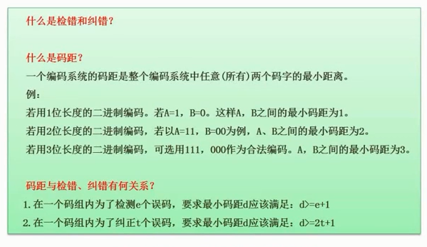

# 2.19  校验码的概念

#### 检错

检查出错误

#### 纠错

不但要检查出来，还得能够把它纠正

#### 码距

任意2个码字的最小距离

#### 码距的长度

假设同样传输2个编码，A和B。

* 当码距=1时，假设A=1，B=0。那么传输一段文字`ABABA`，正确应该传输`10101`,但是此时我传了`11111`
  * 能检错吗？不能，因为1和0都是合法字符。
* 当码距=2时，假设A=11，B=00，那么同样传输一段文字`ABABA`，正确应该传输`11 00 11 00 11`，那当我传了错误数据`10 10 10 00 11`给你
  * 能检错吗？可以，因为没有定义`10`这种码
  * 能纠错吗？不行，因为你不确定是`11->10`还是`00->10`。2种都有可能
* 当码距=3时，假设A=111，B=000，那么同样传输一段文字`ABABA`，正确应该传输`111 000 111 000 111`,当我传输了错误数据`110 000 111 000 111`给你
  * 能检错吗？可以，因为没有定义`100`这种码
  * 能纠错吗？可以，因为我们认为通信链路还是比较可靠的，不会出现错多位的情况。那么`000`和AB2个码对比，就能纠正为`111`

#### 总结规律

* 为了检错n个误码，最小码距应该 >= n+1
* 为了纠错n个误码，最小码距应该 >=2n+1
