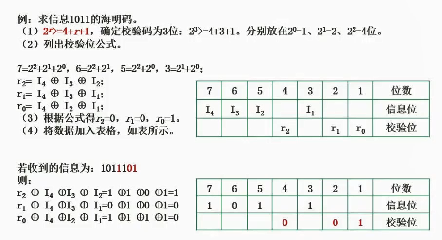
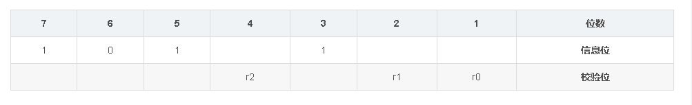
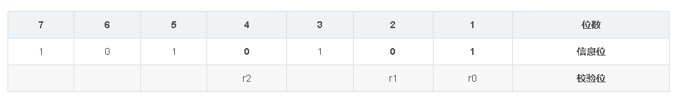
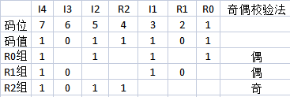
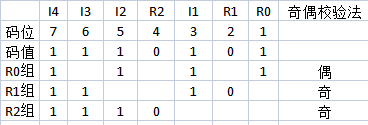
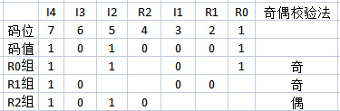

# 2.21  海明校验码



#### 校验位

位于信息编码2^n位置

**假设只有1个信息位，这个编码会有多长？**

由于1（2^0），2（2^1）都是校验位，信息位只能放3这里，那么这个编码就是3位。

#### 通用公式

```
2^r >= m + r+ 1 

其中m为数据位长度，r为最小校验位数量。
```


### 例子

#### 求信息1011的海明码

1. 求校验码位数。

   1. 信息位=4，那么代入公式`2^r>=5+r`
   2. 尝试2，`4>=7`不成立
   3. 尝试3，`8>=8`成立
   4. 得出校验码位数=3

2. 然后画表格

   1. 如上图，把位数按顺序标好。

   2. 然后把校验位按顺序（用下标）填充上去

   3. 最后把1011按按顺序（用下标）填充上去，得到下图。

      

3. 判断每个信息位受哪些校验位影响
   1. I4所在的7号位，`7=2^2+2^1+2^0`，那么I4受R2,R1,R0影响。
   2. I3所在的6号位，`6=2^2+2^1`，那么I3受R2,R1影响。
   3. I2所在的5号位，`5=2^2+2^0`，那么I2受R2,R0影响。
   4. I1所在的3号位，`3=2^1+2^0`，那么I1受R1,R0影响。
4. 以校验码维度汇总
   1. R2（I4,I3,I2）
   2. R1（I4,I3,I1）
   3. R0（I4,I2,I1）
5. 将对应信息码异或计算
   1. R2 = 1 ⊕ 0 ⊕ 1 = 0
   2. R1 = 1 ⊕ 0 ⊕ 1 = 0
   3. R0 = 1 ⊕ 1 ⊕ 1 = 1
6. 得到海明码`1010101`




#### 海明码是如何纠错的

**当传输了一个1011101，怎么判断哪里错了呢**

##### 检错流程

1. 此处传输的校验位
   1. `R2=1,R1=0,R0=1`
   2. `I4=1,I3=0,I2=1,I1=1`
2. 判断每个信息位受哪些校验位影响
   1. I4所在的7号位，`7=2^2+2^1+2^0`，那么I4受R2,R1,R0影响。
   2. I3所在的6号位，`6=2^2+2^1`，那么I3受R2,R1影响。
   3. I2所在的5号位，`5=2^2+2^0`，那么I2受R2,R0影响。
   4. I1所在的3号位，`3=2^1+2^0`，那么I1受R1,R0影响。
3. 以校验码维度汇总
   1. R2（I4,I3,I2）
   2. R1（I4,I3,I1）
   3. R0（I4,I2,I1）
4. 和传输过来的检验位异或判断
   1. R2： R2⊕ I4⊕ I3⊕ I2 = 1⊕1⊕0⊕1=0（有误）
   2. R1： R1⊕ I4⊕ I3⊕ I1 = 0⊕1⊕0⊕1=1（正确）
   3. R0： R0⊕ I4⊕ I2⊕ I1 = 1⊕1⊕1⊕1=1（正确）

5. 得知该海明码有误。


##### 纠错流程

**海明码1011101**



列表算奇数位，发现只有一组有异常的。说明是R2检验位有问题，取反即可。


**海明码1110101**



同理，判断出R1，R2检验码均检测有误。

仅有他们检验的信息位是I3，取反即纠正。


**海明码1010001**



同理，判断出R0，R1检验码均检测有误。

仅有他们检验的信息位是I1，取反即纠正。


