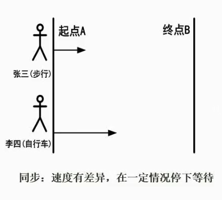
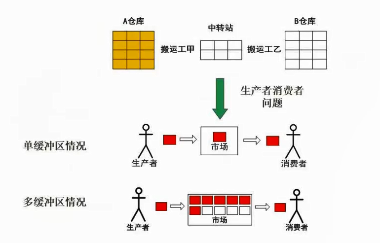

# 3.04  进程的同步与互斥

### 进程互斥

进程互斥是指在多进程操作系统中，为了避免多个进程同时访问共享资源而导致数据不一致的问题，需要对这些共享资源进行互斥控制，使得同一时刻只有一个进程能够访问这些资源。这种互斥控制的机制被称为进程互斥。

常见的进程互斥机制包括使用锁、信号量等同步原语，以及使用互斥量、条件变量等线程同步机制。通过这些机制，可以保证多个进程或线程在访问共享资源时的安全性和正确性。

### 进程同步

进程同步是指在多个进程之间协调和控制它们的执行顺序，以避免出现竞态条件（race condition）和死锁（deadlock）等并发问题。

在多进程系统中，由于每个进程都有自己的执行速度和执行顺序，因此可能会出现多个进程同时访问共享资源的情况，导致数据不一致或者程序出错。

为了解决这些问题，进程同步机制被引入到操作系统中，以确保多个进程可以按照既定的顺序访问共享资源，从而保证系统的正确性和稳定性。

常见的进程同步机制包括互斥锁、信号量、条件变量等。

**生产者与消费者问题，哪里会存在同步，哪里会存在互斥？**

同步是指生产者和消费者之间的协调。生产者只有在缓冲区有空间时才能放入数据，而消费者只有在缓冲区有数据时才能取出数据。因此，生产者和消费者需要互相通信以确保它们在正确的时间进行操作。这可以通过使用信号量或条件变量等同步机制来实现。

互斥是指对共享资源的访问是互斥的。在生产者和消费者问题中，缓冲区是共享资源。因此，只有一个生产者或消费者能够访问缓冲区。这可以通过使用互斥锁来实现。